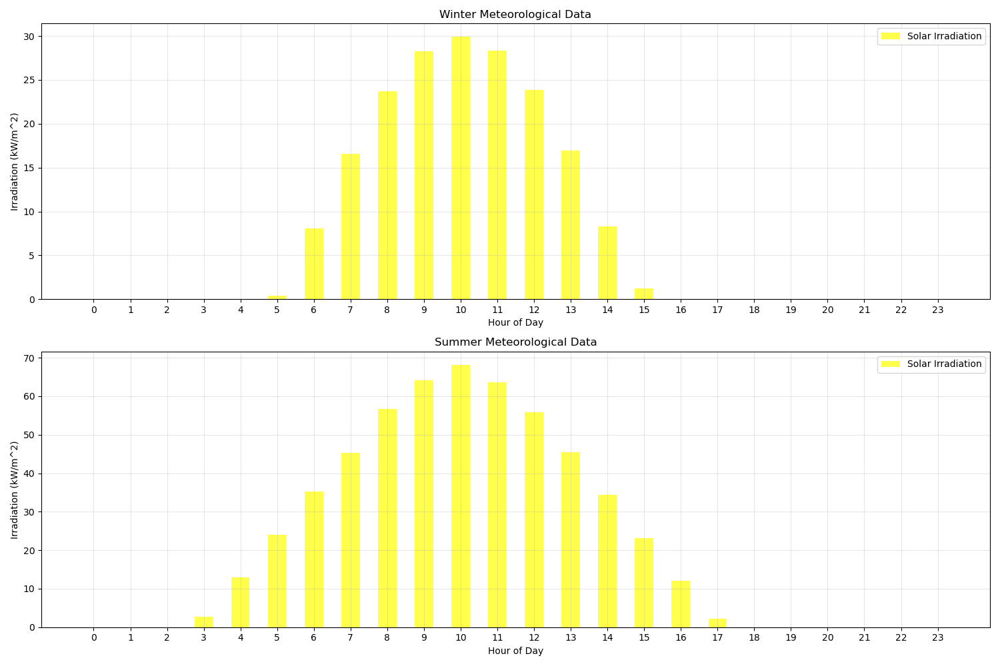
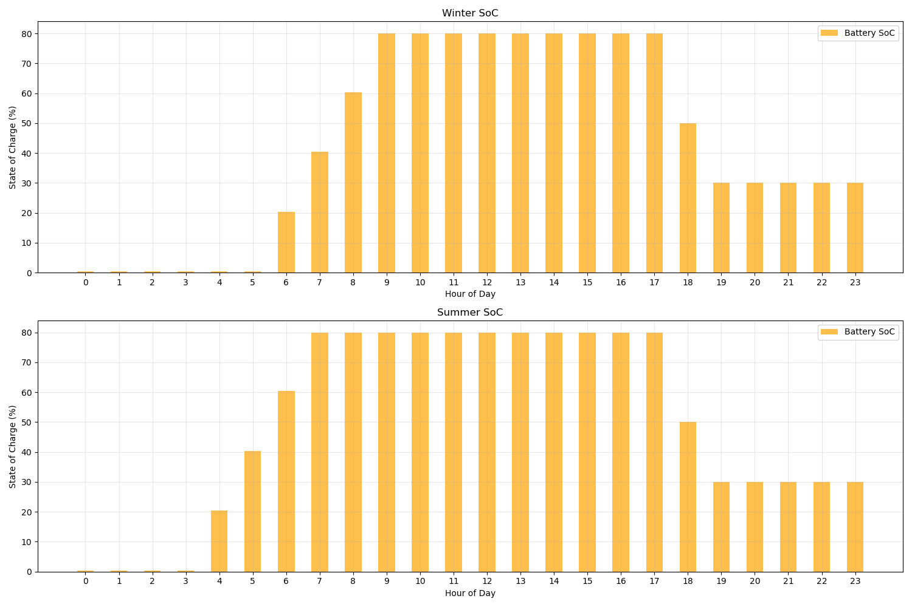
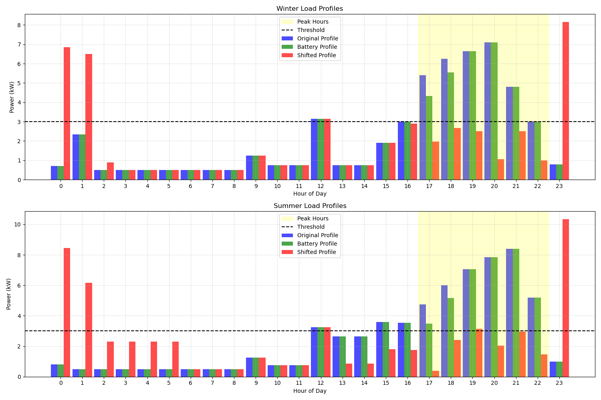
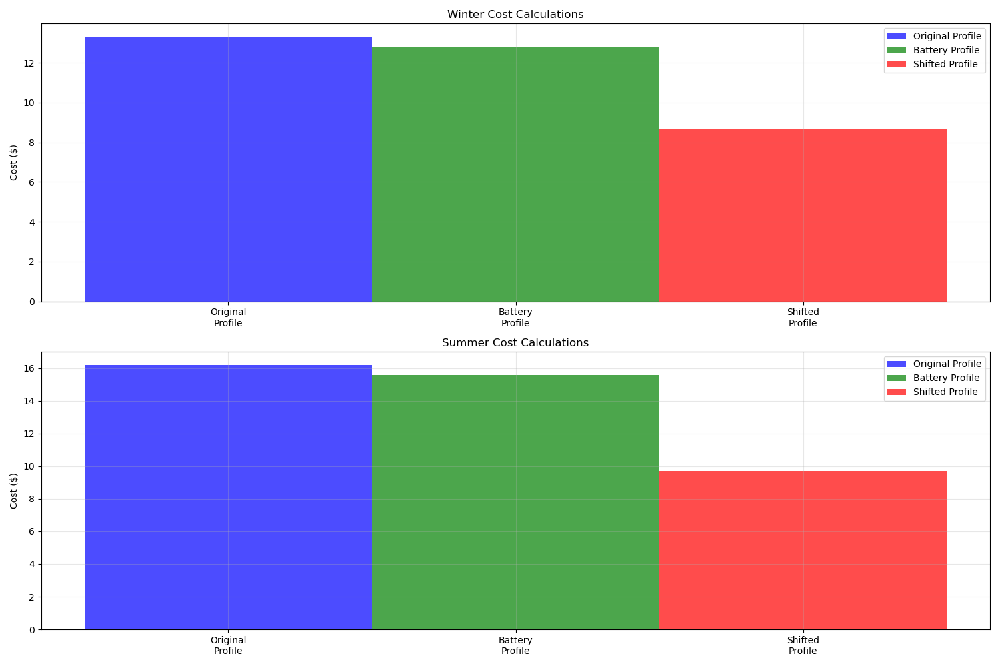
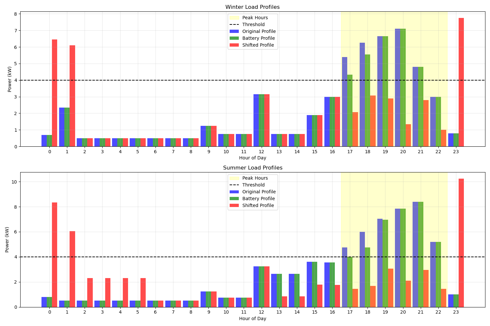
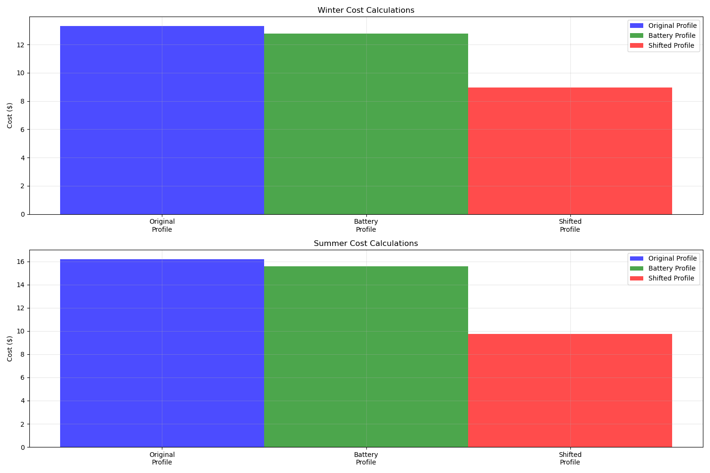
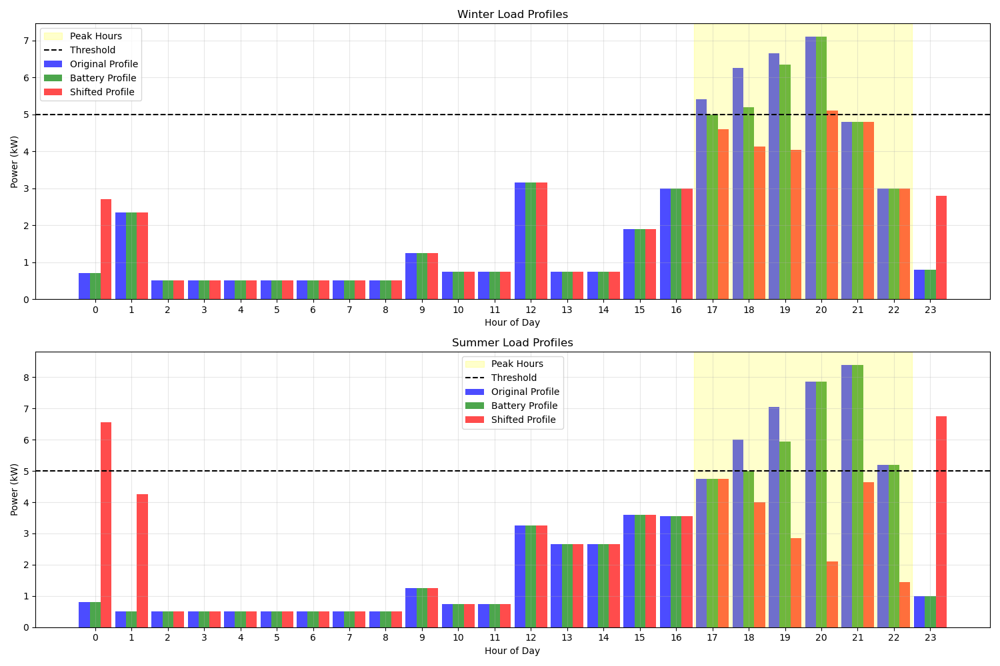
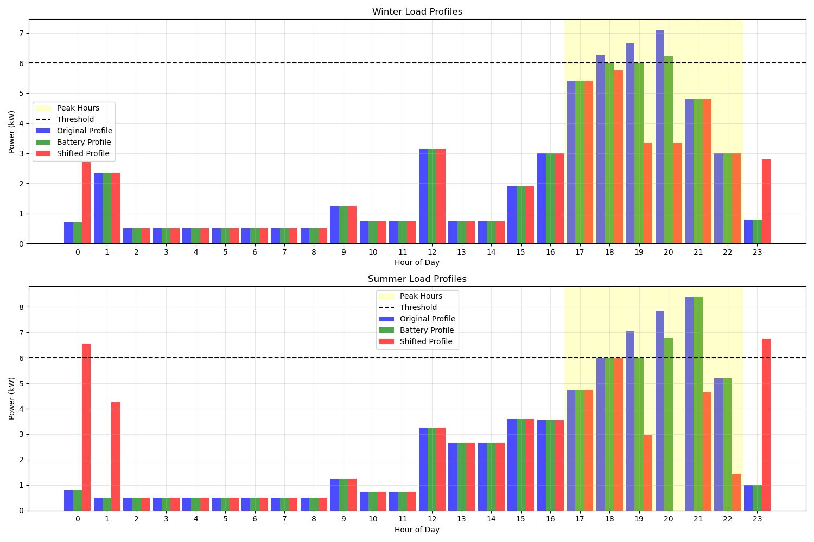
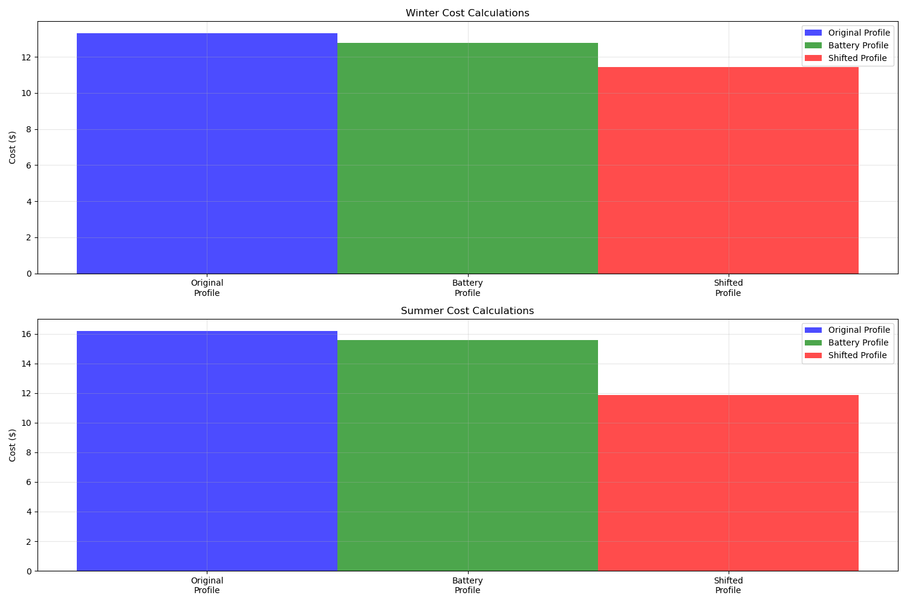

---

# Smart Home Energy Management

## Table of Contents
1. [Overview](#overview)
2. [Instructions](#instructions)
3. [Features](#features)
4. [Data Requirements](#data-requirements)
5. [Installation](#installation)
6. [Usage](#usage)
7. [Detailed Documentation](#detailed-documentation)
8. [Contributing](#contributing)
9. [License](#license)

## Overview
This project provides a smart home model designed to optimize power consumption. By managing energy loads and utilizing renewable energy sources, it helps analyze cost savings and improve energy efficiency.

## Instructions

1. Run the program.
2. Select a load profile and a meteorological data set.
3. Set the threshold value.
4. Press "Analyze".

The program will calculate:
- Cost savings with and without load shifting.
- Cost savings from PV panels (if installed).

## Features

- **Battery Management**
- **Solar Panel Integration**

## Data Requirements

- **Electric Load Profile**
- **Meteorological Data**

## Installation

1. Clone the repository:
   ```bash
   git clone https://github.com/EmirKahraman/Smart_Home.git
   ```
2. Navigate to the project directory:
   ```bash
   cd Smart_Home
   ```
3. Install the required dependencies:
   ```bash
   pip install -r requirements.txt
   ```

## Usage

Execute the main program:
```bash
python main.py
```

## Detailed Documentation
These values were calculated based on the load_profile_v3.xlsx and meteorological_data.csv

#### Solar Irradiation

*Figure 1: Solar Irradiation Data*

#### Battery Status

*Figure 2: Battery Status*

#### Threshold 3
##### Results for Threshold 3

*Figure 3: Results for Threshold 3*

##### Cost Savings for Threshold 3

*Figure 4: Cost Savings for Threshold 3*

#### Threshold 4
##### Results for Threshold 4

*Figure 5: Results for Threshold 4*

##### Cost Savings for Threshold 4

*Figure 6: Cost Savings for Threshold 4*

#### Threshold 5
##### Results for Threshold 5

*Figure 7: Results for Threshold 5*

##### Cost Savings for Threshold 5

*Figure 8: Cost Savings for Threshold 5*

#### Threshold 6
##### Results for Threshold 6

*Figure 9: Results for Threshold 6*

##### Cost Savings for Threshold 6

*Figure 10: Cost Savings for Threshold 6*

## Contributing

Contributions are welcome! Please fork the repository and create a pull request.

## License

This project is licensed under the MIT License.

---
